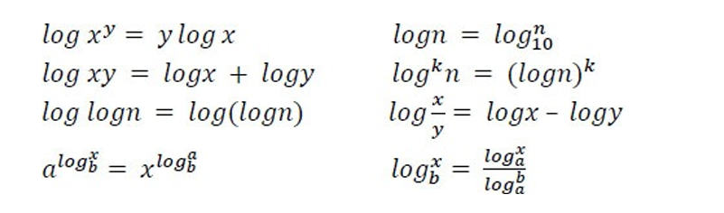
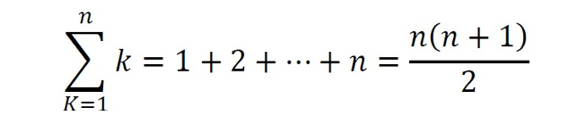
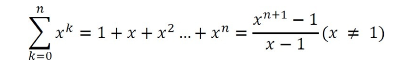
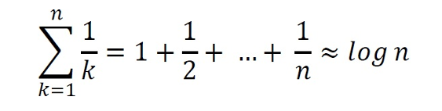
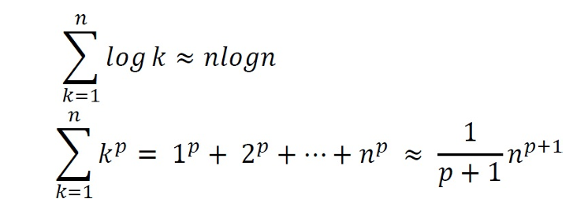

# Introduction 

## Variables

## Data Types
- Data types is a set of data with predefined values.
- System-defined data types (Primitive data types)
    + The number of bits allocated for each data type depends (Programming Languages, OS, compiler)
- User defined data types
    + Structures and classes
    
## Data Structures
- Data structures is a particular way of storing and organizing data in a computer so that it can be used efficiently.
- Data structures ara classified into two types:
    1. Linear data stuctures: Elements are accessed in a sequential order
    2. Non-linear data structures: Elements fo this data structure are stored/accessed in a non-linear order.

## ADTS (Abstract Data Types)
- User defined data types are defined along with their operations
- An ADT consists of two parts:
    1. Declaration of data
    2. Declaration of operations
    
## What is an Algorithm?
- An algorithm is the step-by-step unambiguous instructions to solve a give problem
- There are two main criteria for judging the merits of algorithms:
    + Correctness (solution to the problem ina finite number of steps)
    + Efficiency (how much resourses(memory and time) take to execute )

## Why the analysis of algorithms?
- Algorithms analysis helps us to determine which algorithm is most efficient in terms of time and space consumed

## Goal of the Analysis of Algorithms
- The goal of the analysis of algorithms is to compare algorithms (or solutions)  mainly in terms of running time but also in terms of other factors(e.g, memory, developer effort, etc)

## Asymptotic Notation

### Big-O notation
- This notation give the tight upper bound of the given function

### Omega-O notation
- This notation give the tighter lower bound of the given algorithm 

### Theta-O notation
- This notation decides whether the upper and lower bounds of a give function(algorithm) 

## Important Note
- We generally focus on the upper bound (O), we use the theta-O notation if the upper bound and lower bound are the same.

## Commonly used Logarithms and Summations
- Logarithms

- Arithmetic series

- Geometric series

- Harmonic series  

- Other important formulae

- 